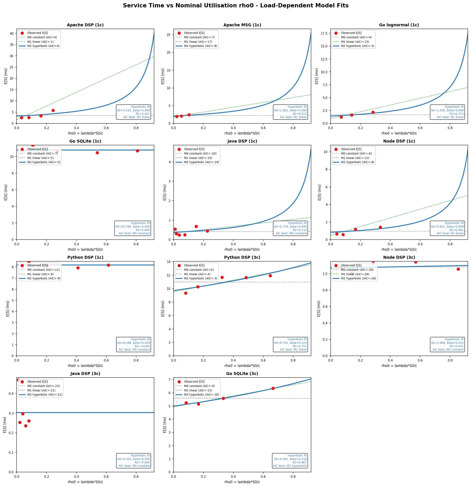
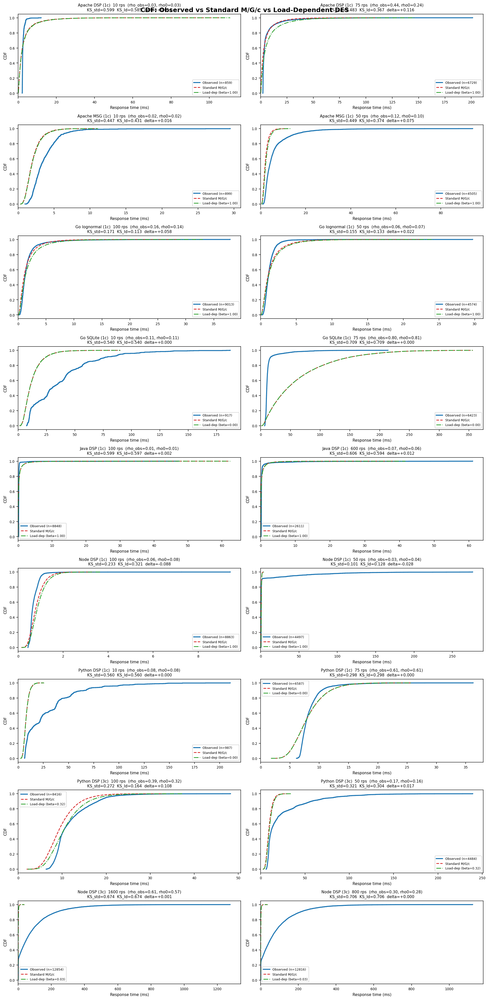
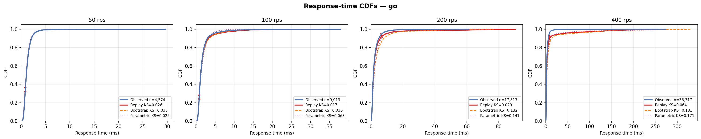
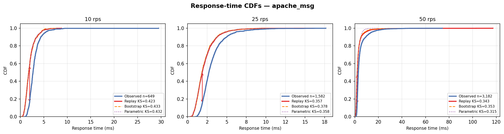
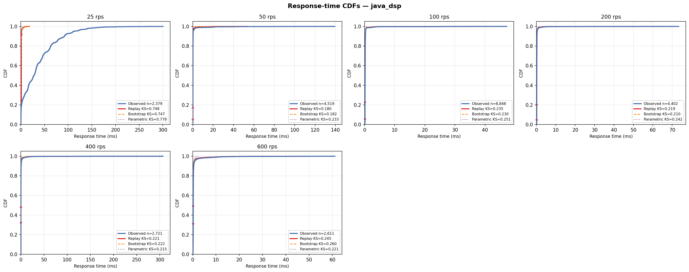
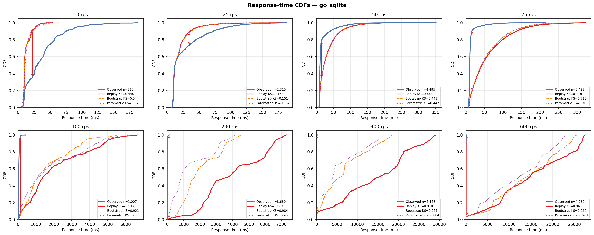
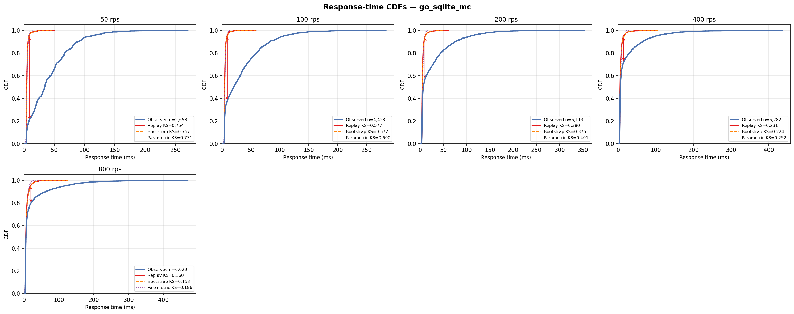

# Docker Container Capacity Modelling — Research Platform

COMP9334 thesis project (UNSW). The core question is: given a measured trace of
real requests to a containerised server, can we accurately predict what the
response-time distribution will look like at a higher load — without running the
server at that load?

We answer this using **Discrete Event Simulation (DES)** driven by queueing
theory, validate the predictions against ground truth, and identify exactly when
and why the approach breaks down.

---

## Background: Key Concepts

### Request timing

Every request goes through three phases:

```
|--- queue_ms ---|--- service_ms ---|
|-------------- response_ms --------|
```

- **service_ms** — time the server is actively processing the request (CPU or I/O)
- **queue_ms** — time the request spent waiting before the server picked it up
- **response_ms** = service_ms + queue_ms (what the client experiences)

At low load, queue_ms ≈ 0 so response ≈ service. At high load, the queue grows
and dominates response time. The goal is to predict this growth.

### Queueing models: M/G/1 and M/G/c

We model each server as a queueing system. The notation M/G/c means:

- **M** — arrivals follow a Poisson process (exponential inter-arrival times),
  which is what our load generator produces
- **G** — service times can follow any ("General") distribution
- **c** — number of parallel workers (servers)

A single-worker server is M/G/1. A server with 3 worker threads or processes is
M/G/3 (a special case of M/G/c). The model says: given the arrival rate and the
service time distribution, what is the response time distribution?

### Server utilisation (rho)

```
rho = arrival_rate × mean_service_time / c
    = lambda × E[S] / c
```

where `lambda` is requests per second, `E[S]` is mean service time in seconds,
and `c` is the number of workers. `rho` is a fraction (0–1) representing how
busy the server is on average. When `rho` approaches 1, the queue grows without
bound. All DES predictions are only valid for `rho < 1`.

### Discrete Event Simulation (DES)

DES replays a sequence of synthetic requests through the queueing model and
records simulated response times. The simulation works as follows:

1. Take the observed arrival times from a real trace (so the inter-arrival
   distribution matches the real workload exactly)
2. For each arriving request, generate a service time — either by replaying
   observed service times, resampling them, or drawing from a fitted distribution
3. Assign the request to the next free worker; if all workers are busy, the
   request waits in a FIFO queue
4. Record when each request finishes (response time = queue wait + service time)

The output is a synthetic trace of simulated response times that can be compared
to real measured response times.

### DES modes

Three modes control how service times are generated during simulation:

| Mode | Service time source | What it tests |
|---|---|---|
| **Replay** | Observed values fed back in arrival order | Queueing model accuracy only — removes any distribution error |
| **Bootstrap** | Random resample (with replacement) from observed values | Sensitivity to sample variance; should be close to replay |
| **Parametric** | Fit a lognormal (default), gamma, or Weibull to the data and sample | How well the assumed distribution family matches reality |

Replay is the most informative: if replay KS is high, the queueing model itself
is wrong (hidden contention, load-dependent service times). If replay KS is low
but parametric KS is high, only the distribution assumption is wrong.

### CDF and KS distance

A **Cumulative Distribution Function (CDF)** at value x gives the fraction of
requests with response time ≤ x. Plotting observed vs simulated CDFs on the same
axes shows exactly where they diverge.

The **Kolmogorov-Smirnov (KS) distance** is the maximum vertical gap between the
two CDFs across all x values:

```
KS = max over all x of |F_observed(x) − F_simulated(x)|
```

It is computed as follows:
1. Merge all unique response time values from both the observed and simulated lists
2. At each unique value x, compute what fraction of observed requests finished by
   x and what fraction of simulated requests finished by x
3. KS = the largest absolute difference found in step 2

KS is always between 0 and 1. A value of 0 means the two distributions are
identical; a value of 1 means they do not overlap at all. KS is unit-free and
does not depend on the scale of response times, making it comparable across
servers with very different service rates.

In the CDF plots (`data/experiments/*/cdf.png`), the red double-headed arrow shows
the location and magnitude of the KS gap.

### Capacity knee

The **capacity knee** is the arrival rate at which response time starts growing
rapidly — the practical saturation point. Below the knee, response time is
roughly flat. Above it, queue build-up causes response time to diverge. For an
M/G/1 queue the theoretical knee is at `rho = 1`, but in practice servers show
degradation earlier due to contention or service time growth.

---

## Research Agenda

| Iteration | Focus | Status |
|---|---|---|
| 1 | Single-server M/G/1: DES validation, operational laws, ML baseline | **Complete** |
| 2 | Multi-runtime comparison + M/G/c multi-worker scaling | **Complete** |
| 3 | Queueing networks: two-tier service, MVA comparison | Planned |
| 4 | MLASP pipeline: `(cpu_limit, arrival_rate) → response_p99` | Planned |

---

## Term Progress Summary

This term converted the project from a basic Docker capacity-planning prototype
into a reproducible experimental research platform. The original milestone was
to validate a simple queueing/DES model against one or two containerised
services; the delivered system now covers 11 server configurations across Go,
Apache/PHP, Node.js, Python/Gunicorn, Java, and Go SQLite, with automated load
sweeps, trace collection, DES replay, generated CDF plots, per-server reports,
and cross-server result tables.

The main technical achievement is that the project now explains not only when
M/G/1 and M/G/c models work, but also why they fail. The baseline DES was
implemented for both single-worker and multi-worker queues, then validated
against real traces using replay, bootstrap, and parametric service-time modes.
This made it possible to separate three causes of prediction error: queueing
model mismatch, service-time distribution mismatch, and measurement/runtime
artefacts. The best cases, such as Go lognormal and Python 3-core, achieve low
KS distance, showing that the DES machinery is sound when the assumptions hold.

A new result emerged beyond the original plan: several CPU-bound servers show
load-dependent service time. Mean service time increases with utilisation,
violating the constant-service-time assumption used by standard M/G/c models.
To quantify this, a hyperbolic service-time inflation model was fitted per
server and a load-dependent DES was implemented. Across the stable CPU-bound
measurement points, the load-dependent model improves the response-time CDF fit
relative to the standard M/G/c baseline. This turns an observed discrepancy into
a concrete thesis contribution: OS/runtime scheduling contention can make
service time itself a function of load.

The work also identified two structural cases that require future model
extensions rather than parameter tuning. Go SQLite behaves like a tandem queue:
an application queue feeding an internal SQLite/WAL lock queue. Node.js cluster
does not behave like a shared M/G/3 queue; it is closer to three independent
M/G/1 queues with load balancing/Bernoulli splitting. These findings define the
next modelling direction more sharply than the original milestone plan.

### Progress Against Milestones

| Milestone | Planned outcome | Current progress |
|---|---|---|
| Experimental platform | Docker services, repeatable load generation, basic monitoring | **Exceeded.** Platform now includes 11 server configs, Poisson load generators, server-side timing logs, Docker Compose CPU pinning, generated experiment READMEs, and a modular repo layout. |
| Single-server DES | Validate M/G/1 against measured traces | **Complete.** Trace-driven M/G/1 DES supports replay, bootstrap, and parametric modes; KS distance and operational laws are used for validation. |
| Multi-worker DES | Extend to M/G/c and compare multicore scaling | **Complete.** Heap-based M/G/c simulator validates Node.js, Python, Java, and Go SQLite 3-core variants; scaling differences are measured and explained. |
| ML baseline | Compare queueing/DES against a simple data-driven predictor | **Partially complete.** Polynomial LOOCV baseline exists for Go response p99; full MLASP pipeline is still open. |
| Load-dependent service model | Not originally a formal milestone | **New contribution.** Fitted `E[S] = S0 / (1 - beta*rho0)` style models and implemented load-dependent DES, explaining CPU-bound service-time inflation. |
| Structural model extensions | Queueing networks and richer architectures | **Defined, not implemented.** Go SQLite suggests a two-stage tandem queue; Node.js cluster suggests split M/G/1 queues rather than shared M/G/3. |
| Thesis/report consolidation | Turn experiments into reusable artefacts and thesis material | **In progress.** Results, CDF overlays, fit plots, per-server summaries, and the modular workspace are ready; formal thesis chapters and teaching worksheets remain to be written. |

Overall, the project is ahead of the original DES validation milestones and has
produced a clearer research contribution than expected: standard M/G/c works
only when service time is independent of load, and several real containerised
runtimes violate that assumption through scheduler, runtime, or database-lock
contention. The remaining work is to turn these findings into formal models for
the two non-standard architectures and to integrate them into the thesis
narrative.

---

## Plots And Analysis

This repository currently contains 13 generated plots: two cross-server
load-dependent service-time figures in `results/figures/`, and one
observed-vs-DES CDF overlay for each of the 11 experiment folders in
`data/experiments/`. The root README includes all of them here so the visual
evidence and interpretation can be reviewed without hunting through folders.

### Cross-Server Load-Dependent Service-Time Results

#### Service-Time Inflation Fit



This figure plots measured mean service time against nominal utilisation
`rho0 = lambda*S0/c` for each server and overlays the fitted service-time model.
It shows the core result of this term: several CPU-bound servers do not have
constant service time as load increases. Apache DSP, Apache MSG, Go lognormal,
Node DSP, and Python DSP 3-core show positive service-time growth; Python DSP
1-core is nearly flat because the single Gunicorn worker/GIL path serialises
execution; Go SQLite 1-core is mostly flat in mean service time but still fails
standard single-stage queueing for structural reasons. This supports the
load-dependent formulation `E[S](rho0) = S0 / (1 - beta*rho0)` as an empirical
correction to the standard M/G/c assumption.

#### Load-Dependent DES CDF Comparison



This figure compares observed response-time CDFs against the standard M/G/c DES
and the load-dependent DES at low and high stable rates. The key pattern is that
the load-dependent DES shifts the simulated response distribution toward the
observed one when service time grows with utilisation. The improvement is largest
for the CPU-contention cases, especially Apache DSP and Python DSP 3-core. Cases
with approximately constant service time, such as Python DSP 1-core, Java DSP
3-core, and Node DSP 3-core, show little or no change, which is the expected
control behaviour. Go SQLite remains a structural mismatch because a single
application queue does not model the hidden SQLite/WAL lock queue.

### Per-Server DES CDF Plots

Each plot below overlays the observed response-time CDF with replay, bootstrap,
and parametric DES predictions for every tested rate. Replay tests the queueing
model itself; bootstrap tests sensitivity to service-time sample variance; and
parametric tests whether a fitted distribution, usually lognormal, is adequate.

#### Go Lognormal 1-Core



This is the baseline control case. The server samples service times from a
lognormal-like workload and behaves closest to the M/G/1 assumptions. Replay DES
achieves very low KS distances across stable rates, showing that the DES engine
and trace-driven arrival replay are valid when service time is independent and
well described by the sampled distribution. Any remaining error is small and
mostly due to runtime scheduling overhead and high-load service-time drift.

#### Apache Messaging 1-Core



Apache MSG shows a persistent KS floor because the PHP workers share a
file-backed JSONL store protected by file locks. The standard M/G/1 model sees
only one application queue, but the real system contains a hidden shared-resource
queue around the file lock. This makes the CDF gap structural: changing the
parametric distribution cannot remove the mismatch.

#### Apache DSP-AES 1-Core


Apache DSP works reasonably at light load but deteriorates as utilisation grows.
The CDF panels show the classic symptom of load-dependent service time: the DES
predicts a response distribution that is too optimistic because it assumes the
same service-time distribution at all rates. At saturation, worker processes
competing on one CPU core inflate wall-clock service time and the M/G/1
assumption collapses.

#### Node.js DSP-AES 1-Core


Node.js 1-core has a single event loop, but the measured service distribution is
not cleanly unimodal. Garbage collection, callback bookkeeping, and event-loop
stalls create occasional large delays. The CDF mismatch is therefore strongest
where the model tries to match the centre of the distribution using a smooth
parametric service model. At very high load, queueing dominates and the relative
impact of the service-shape mismatch becomes smaller.

#### Python DSP-AES 1-Core


Python 1-core is the strongest constant-service-time control among the CPU-bound
servers. Once cold-start effects are past, service time is near-deterministic
because one Gunicorn worker executes the pure-Python DSP path serially. The CDF
fit improves at moderate rates, supporting the interpretation that the GIL and
single-worker design prevent the CPU competition seen in multi-process servers.

#### Java DSP-AES 1-Core



Java 1-core is dominated by warm-up rather than queueing-model behaviour. The
early interpreted/JIT-compilation phase creates a bimodal service-time
distribution, which explains the large CDF gap at low rates. After warm-up, the
JCE-accelerated AES path is very fast and tested utilisation remains low, so the
main modelling issue is runtime phase change, not saturation.

#### Go SQLite 1-Core



Go SQLite 1-core demonstrates that I/O-bound systems can fail standard M/G/1 for
the same broad reason as CPU-bound systems: the visible application queue is not
the whole queueing network. SQLite introduces an internal database lock/commit
queue, so response time is shaped by both the Go request path and SQLite's
serialised work. This points toward a two-stage tandem queue model.

#### Node.js DSP-AES 3-Core


Node.js cluster mode is the clearest architectural mismatch. The plotted CDFs
remain far from the shared M/G/3 prediction at all rates because the system is
not one FIFO queue feeding three identical workers. It is closer to three
independent event loops behind OS/Node connection dispatch, which behaves like
Bernoulli splitting into multiple M/G/1 queues. Adding cores improves throughput
but does not fix the distribution mismatch.

#### Python DSP-AES 3-Core


Python 3-core is the best M/G/c success case. Three Gunicorn worker processes on
three pinned cores behave like independent workers, and service time remains
tight enough for the DES assumptions to hold. The CDF overlays are close at
100-300 rps, validating the heap-based M/G/3 simulator and showing near-linear
capacity scaling relative to the 1-core Python server.

#### Java DSP-AES 3-Core


Java 3-core behaves similarly to Java 1-core: the tested rates are still far
below the server's theoretical CPU capacity, so response-time shape is governed
more by JVM warm-up/runtime variance than by queue build-up. Moving from 1-core
to 3-core does not remove the JIT-induced distribution shape issue.

#### Go SQLite 3-Core



Go SQLite 3-core improves throughput but does not become a clean M/G/3 system.
WAL mode permits more concurrency than the 1-core SQLite case, but writes are
still serialised internally. The CDFs show partial agreement at higher rates
because queueing dominates, but the real architecture is still better described
as application workers feeding a database lock stage.

---

## Thesis Documentation Map

The Thesis B/C narrative is now captured in the LaTeX source under
`docs/latex/thesis/` and included from `sample-thesis.tex`. These chapters
preserve both the clean results and the research-discovery arc: what broke, why
the modelling direction changed, and what remains to ask the supervisor.

| File | What it contains |
|---|---|
| `docs/latex/thesis/research_journey.tex` | Chronological account of the project difficulties and pivots: CPU pinning, Apache routing, PHP timing reconstruction, CSV corruption, Go saturation/rejections, Java JIT warm-up, DES performance fixes, Node cluster mismatch, Go SQLite tandem-queue discovery, and the D-13/D-14 load-dependent service-time finding that motivated the beta model. |
| `docs/latex/thesis/methodology_b.tex` | Experimental platform and multi-server methodology: server catalogue, runtime concurrency models, Poisson load generation, trace/summary CSV schema, batch DES replay, lognormal parameterisation, KS validation, and visualiser/live-load tooling. |
| `docs/latex/thesis/loaddep_model.tex` | Load-dependent service-time model: why constant-service-time M/G/c fails, OS-level processor-sharing explanation, M0/M1/M2 candidate fits, AIC selection, beta table, Java JIT anomaly, Node 3-core structural mismatch, load-dependent DES equation, and KS validation. |
| `docs/latex/thesis/conclusion_b.tex` | Thesis B conclusion and future work: contributions, limitations, MLASP comparison, why service-time ML was replaced by the mechanistic beta model, why ML remains useful for arrival-rate forecasting, industrial scalability, Kubernetes HPA/feedforward autoscaling relevance, and candidate Thesis C models. |
| `docs/latex/thesis/mywork.tex` | Updated literature review positioning: MLASP comparison, high-value open gaps in capacity planning, and the corrected explanation of how the Thesis A ML-DES plan evolved into the current mechanistic beta + future arrival-forecasting approach. |
| `docs/DIFFICULTIES.md` | Raw research/debugging log that backs the `research_journey.tex` chapter. This is the detailed source of the mishaps, fixes, and discoveries. |

The key supervisor discussion point is documented in the conclusion and future
work sections: first present the finding that CPU-bound containerised servers
show load-dependent service time due to OS/runtime scheduling, then ask whether
that contribution is sufficient as the core Thesis C direction or whether it
should be extended into one of three harder model families: priority queues,
tandem microservice queues, or retry-feedback queues.

---

## Progress Against Thesis A Plan

Thesis A (submitted November 2025) laid out six work strands for Thesis B and C.
The table below tracks what was promised, what was delivered — including work that
went beyond the plan — and what remains open.

### Strand 1 — Experimental platform

| | Detail |
|---|---|
| **Promised** | Finalise Docker microservice; automate Vegeta load generation; stand up cAdvisor / Prometheus / Grafana observability stack; collect traces of arrival rates, service times, CPU utilisation, and tail latency across a range of loads and CPU quotas |
| **Delivered** | Docker Compose platform with CPU pinning (`cpuset`, `cpus`) confirmed working. Custom open-loop Poisson load generators written in Python replace Vegeta — these emit requests with exponential inter-arrival times which directly satisfy the M/G/c arrival assumption, whereas Vegeta enforces a fixed schedule. Server-side CSV logging (`arrival_unix_ns`, `service_ms`, `queue_ms`, `response_ms`, `status_code`) records all three timing components per request, giving more information than Vegeta's client-side latency reports. |
| **Beyond plan** | Platform expanded from one echo-server to **seven distinct server implementations** across five languages (Go, PHP/Apache, Node.js, Python, Java) plus a Go SQLite I/O-bound variant — totalling **11 server configurations** (7 single-core, 4 three-core). cAdvisor/Prometheus/Grafana stack was dropped in favour of server-side instrumentation: simpler to operate on a laptop, and provides the service-time decomposition that Prometheus cannot. |
| **Remaining** | CPU throttling telemetry (cgroup counters, throttle fraction) and error-budget burn-rate tracking — mentioned in §4.4 as future integration during Thesis B — have not been implemented. These would allow modelling of noisy-neighbour CPU contention effects. |

### Strand 2 — Single-server DES modelling and calibration

| | Detail |
|---|---|
| **Promised** | Build a baseline M/G/1 DES that reproduces measured behaviour under fixed load. Calibrate using empirical arrival rate λ and service-time samples. Validate against observed mean response time and utilisation. |
| **Delivered** | `analysis/des/single_server_des.py` implements a trace-driven M/G/1 FCFS simulator with three service-time modes. The KS distance between the simulated and observed response-time CDFs is used as the primary accuracy metric. Operational law checks (Utilisation Law `U = XS`, Little's Law `N = XR`) are computed and reported. |
| **Beyond plan** | Three validation modes (replay / bootstrap / parametric) were not in the original plan. Replay isolates queueing-model accuracy from distribution-fit error; bootstrap quantifies sensitivity to sample variance; parametric tests the lognormal/gamma/Weibull assumption. This decomposition allows the source of any KS degradation to be diagnosed precisely — something the plan did not anticipate needing. The goroutine scheduling floor (`--queue-offset 0.006 ms`) was identified and corrected as a systematic measurement artefact. |
| **Remaining** | Validation against purely analytical M/M/1 and Pollaczek–Khinchine (P-K) formula predictions has not been done explicitly. The plan called for comparing DES against analytical baselines; currently DES is only compared against ground truth and against the ML polynomial regression baseline. |

### Strand 3 — Multi-server and multicore DES extensions

| | Detail |
|---|---|
| **Promised** | Extend the simulator to M/M/c or M/G/c cases modelling multiple service threads or container replicas. Incorporate simple CPU throttling models to capture noisy-neighbour effects at higher utilisation. |
| **Delivered** | `analysis/des/multi_server_des.py` implements a heap-based M/G/c event-driven simulator supporting arbitrary worker counts. Four server configurations run with `c = 3` workers (Node.js cluster, Gunicorn, Java ThreadPool, Go SQLite WAL). The DES is validated against all four using the same three modes as the single-server case. |
| **Beyond plan** | The multi-core experiments revealed that throughput scaling is architecture-dependent (Python 3.0×, Go SQLite 2.2×, Node.js 2.3×) and that DES accuracy in the multi-core setting is entirely determined by service-time distribution shape rather than worker count. This was not a hypothesis in the plan — it emerged from the data. |
| **Remaining** | CPU throttling models (noisy-neighbour effects at high utilisation) have not been incorporated into the DES engine. The plan explicitly listed this; it remains open. |

### Strand 4 — Machine-learning models for service time and workload

| | Detail |
|---|---|
| **Promised** | Train ML models to (i) learn empirical service-time distributions as a function of CPU quota and request rate using KDE, Gaussian mixture models, or gradient-boosted regressors; and (ii) forecast arrival rates λ(t) from historical monitoring data using ARIMA or gradient boosting. Feed these into the DES engine. |
| **Delivered** | `ml_baseline.py` fits a polynomial regression model to predict `response_p99` from arrival rate using leave-one-out cross-validation (LOOCV), establishing an ML accuracy baseline for comparison with DES. The key finding — DES outperforms ML at light load (rho < 0.3) while ML outperforms DES near saturation — is quantified. |
| **Remaining** | The full ML programme described in the plan has not been implemented: no KDE or GMM service-time models, no gradient-boosted regressors, and no arrival-rate forecasting (ARIMA or otherwise). `ml_baseline.py` is a comparison tool, not the ML pipeline the plan described. This is the largest gap between plan and delivery. |

### Strand 5 — Hybrid ML–DES integration and evaluation

| | Detail |
|---|---|
| **Promised** | Integrate ML-estimated service-time distributions and forecasted arrivals into the DES engine. Evaluate prediction of mean latency, utilisation, and tail behaviour (p95/p99) under varying load and resource scenarios. Compare against purely analytical and purely ML baselines. |
| **Delivered** | Not implemented. ML and DES remain separate tools. The comparison between them uses ground-truth traces rather than an integrated pipeline. |
| **Remaining** | The full hybrid ML–DES pipeline is unbuilt. This is the central deliverable of Thesis B/C and the most industrially novel contribution described in Thesis A. It requires completing Strand 4 first. |

### Strand 6 — Educational artefacts and thesis consolidation

| | Detail |
|---|---|
| **Promised** | Design lab scripts, exercises, and visualisations for COMP9334 students to reproduce experiments on their own machines. Draft and refine thesis chapters (results, discussion, conclusions). |
| **Delivered** | The repository is structured to be fully reproducible on any machine with Docker Desktop and Python 3.10+. Every experiment folder contains a `README.md` with a results table, CDF plot, and interpretation notes auto-generated by `write_server_readmes.py`. All load generators, DES scripts, and sweep orchestrators are documented with exact commands in the root README. |
| **Beyond plan** | CDF visualisations comparing observed vs simulated distributions (replay, bootstrap, parametric) with annotated KS arrows were not mentioned in the plan. Per-server READMEs with expected KS ranges and diagnostic guidance were also not planned — they emerged from the need to interpret results across 11 configurations. |
| **Remaining** | Formal COMP9334 lab scripts (worksheets with guided questions) have not been written. The plan called for exercises that walk students through queueing-theoretic interpretation of the results; these do not yet exist as standalone teaching documents. Thesis B/C chapters (results, discussion, conclusions) are not drafted. |

### Current Thesis B Status Update

The milestone table above preserves the original Thesis A plan, but the current
state of the project has moved beyond several of those rows. The most important
change is that the planned service-time ML component was not merely left
unfinished; it was superseded by a simpler mechanistic discovery. The traces
showed that service-time distribution shape was often stable while the mean grew
with utilisation, so KDE/GMM/boosted-regression service-time learning was
replaced by the two-parameter load-dependent beta model grounded in OS
Processor-Sharing behaviour.

ML therefore remains valuable in a narrower and cleaner role: forecasting future
arrival rate. Queueing theory and DES can answer "given `lambda`, what happens
to response time?", but they cannot answer "what will `lambda` be in 10 minutes?"
The documented future hybrid pipeline is therefore:

```text
ARIMA/Prophet forecast of lambda(t + delta)
        -> load-dependent DES with fitted S0 and beta
        -> predicted SLO breach / saturation knee
        -> proactive scaling signal before queues build
```

The Thesis B chapters are now drafted under `docs/latex/thesis/` and included
from `sample-thesis.tex`. The remaining thesis work is not to draft the basic
chapters from scratch, but to choose the Thesis C model extension with the
supervisor and validate it: fixed-point load-dependent DES, arrival-rate
forecasting, cloud/native-Linux validation, or one of the harder queueing models
such as priority classes, tandem microservice queues, or retry-feedback loops.

---

## Servers Under Test

All containers run on Docker Compose. Single-core variants pin to `cpuset=0,
cpus=1.0`; multi-core variants pin to `cpuset=0,1,2, cpus=3.0`. Run only one
server at a time to avoid cross-container CPU contention.

The **service pipeline** used by all DSP-AES servers is identical: AES-256-CBC
decrypt → 64-tap FIR low-pass filter → AES-256-CBC re-encrypt on 1024 float32
audio samples. This is a realistic CPU-bound workload with predictable memory
access patterns.

### Single-core (c = 1)

| Service | Port | Architecture | Avg service time | Capacity knee | Best KS |
|---|---|---|---|---|---|
| `app` (Go lognormal) | 8080 | Single goroutine FCFS queue | ~1.1 ms | ~190 rps | 0.017 |
| `apache` (PHP messaging) | 8082 | mpm_prefork + file lock | ~1.8 ms | ~30 rps | 0.315 |
| `apache-dsp` (PHP AES+FIR) | 8083 | mpm_prefork, CPU-bound | ~2.3 ms | ~50 rps | 0.137 |
| `node-dsp` (JS AES+FIR) | 8084 | Single event loop | ~0.5 ms | ~600 rps | 0.140 |
| `python-dsp` (Py AES+FIR) | 8085 | Gunicorn single worker | ~7.5 ms | ~90 rps | 0.105 |
| `java-dsp` (JVM AES+FIR) | 8086 | ThreadPoolExecutor 4 threads | ~0.2 ms | >2000 rps | 0.158 |
| `go-sqlite` (Go SQLite) | 8087 | Single goroutine FCFS queue | ~10 ms | ~75 rps | 0.151 |

### Multi-core (c = 3, three CPU cores)

| Service | Port | Architecture | Capacity knee | Scaling vs 1c | Best KS |
|---|---|---|---|---|---|
| `node-dsp-mc` | 8088 | Node.js cluster, 3 processes | ~1400 rps | 2.3x | 0.664 |
| `python-dsp-mc` | 8089 | Gunicorn 3 workers | ~270 rps | 3.0x | 0.039 |
| `java-dsp-mc` | 8090 | ThreadPoolExecutor 3 threads | >2000 rps | ~1x | 0.158 |
| `go-sqlite-mc` | 8091 | 3 goroutines, SQLite WAL | ~165 rps | 2.2x | 0.153 |

---

## Repository Layout

See [PROJECT_MAP.md](PROJECT_MAP.md) for the current modular workspace map.

```text
Capacity_lab/
+-- servers/              # Docker service implementations
+-- analysis/             # DES, load generators, orchestration, reporting, visualisation
+-- data/                 # Experiment traces and live container CSV logs
+-- results/              # Cross-server figures and CSV result tables
+-- docs/                 # Experiment log, difficulties log, thesis source, references
+-- docker-compose.yml
+-- environment.yml
+-- README.md
```

---
## Dependencies

```bash
pip install requests matplotlib cryptography

# Or via conda
conda env create -f environment.yml
conda activate capacity_lab
```

Python 3.10+ and Docker Desktop (Linux engine) required.

---

## Full Replication Guide

These steps reproduce every file in `data/experiments/` from scratch. Each step is
independent and idempotent (safe to re-run; existing output files are skipped).

### Step 1 — Start a server

Start one server at a time. Each is pinned to specific CPU cores in
`docker-compose.yml` so containers do not steal CPU from each other.

```bash
docker compose up -d --build app           # Go lognormal          (port 8080)
docker compose up -d --build apache        # Apache messaging       (port 8082)
docker compose up -d --build apache-dsp    # Apache DSP-AES        (port 8083)
docker compose up -d --build node-dsp      # Node.js DSP-AES 1c    (port 8084)
docker compose up -d --build python-dsp    # Python DSP-AES 1c     (port 8085)
docker compose up -d --build java-dsp      # Java DSP-AES 1c       (port 8086)
docker compose up -d --build go-sqlite     # Go SQLite 1c          (port 8087)
docker compose up -d --build node-dsp-mc   # Node.js cluster 3c    (port 8088)
docker compose up -d --build python-dsp-mc # Gunicorn 3 workers 3c (port 8089)
docker compose up -d --build java-dsp-mc   # Java thread pool 3c   (port 8090)
docker compose up -d --build go-sqlite-mc  # Go SQLite WAL 3c      (port 8091)
```

Wait ~5 s after starting the JVM or Gunicorn servers before sending load — they
have a warm-up phase before reaching steady-state throughput.

### Step 2 — Run load sweeps

The load generators send requests following a Poisson process (exponential
inter-arrival times) at a fixed average rate. Poisson arrivals are standard for
validating M/G/c models because the M/G/c queue assumes Poisson input.

Each sweep runs for 90 s per rate point and writes a trace CSV to
`data/experiments/<folder>/`. Existing files are skipped automatically.

```bash
python analysis/orchestration/run_sweeps.py --servers node_dsp
python analysis/orchestration/run_sweeps.py --servers go_sqlite
python analysis/orchestration/run_sweeps.py --servers java_dsp
python analysis/orchestration/run_sweeps.py --servers node_dsp_mc
python analysis/orchestration/run_sweeps.py --servers python_dsp_mc
python analysis/orchestration/run_sweeps.py --servers java_dsp_mc
python analysis/orchestration/run_sweeps.py --servers go_sqlite_mc
```

To run everything unattended (~3–4 hours total):
```bash
python analysis/orchestration/run_sweeps.py
```

Each trace CSV contains one row per request:
```
arrival_unix_ns, service_ms, queue_ms, response_ms, status_code
```

### Step 3 — Run DES on all traces

```bash
python analysis/orchestration/run_des_all.py
python analysis/orchestration/run_des_all.py --servers go python_dsp
```

For each trace CSV in `data/experiments/<folder>/`, this runs all three DES modes and
writes four files back to the same folder:

```
<tag>_<rate>rps_des_replay.csv      — simulated trace, replay mode
<tag>_<rate>rps_des_bootstrap.csv   — simulated trace, bootstrap mode
<tag>_<rate>rps_des_parametric.csv  — simulated trace, parametric mode
<tag>_summary.csv                   — per-rate summary (rho, KS distances, percentiles)
```

The DES output CSVs have the schema:
```
sim_arrival_s, sim_response_ms, sim_queue_ms, sim_status
```

### Step 4 — Generate CDF plots

```bash
python analysis/reporting/plot_all_cdfs.py
python analysis/reporting/plot_all_cdfs.py go_1c
```

Each `cdf.png` has one panel per rate point. Each panel shows:
- Solid blue line: observed response-time CDF from the real trace
- Dashed red: replay DES CDF, labelled with its KS distance
- Dashed orange: bootstrap DES CDF
- Dotted purple: parametric DES CDF
- Red double arrow: position and magnitude of the KS gap (replay only)

### Step 5 — Regenerate per-server READMEs

```bash
python analysis/reporting/write_server_readmes.py
```

Reads each `*_summary.csv` and overwrites `data/experiments/*/README.md` with a
formatted results table and interpretation notes.

### Step 6 — ML baseline comparison (Go server)

```bash
python analysis/des/ml_baseline.py
```

Fits a polynomial regression model to predict `response_p99` from arrival rate
using leave-one-out cross-validation (LOOCV — train on all rate points except
one, predict the held-out point, repeat). Compares prediction error against DES
replay. Requires `data/experiments/go_1c/` data.

---

## Running DES on a Single Trace Manually

```bash
# M/G/1 (single-worker server)
python analysis/des/single_server_des.py \
  --input  data/experiments/go_1c/go_100rps.csv \
  --output des_out.csv \
  --mode   replay

# M/G/c (multi-worker server, e.g. 3 workers)
python analysis/des/multi_server_des.py \
  --input   data/experiments/python_dsp_3c/python_dsp_mc_100rps.csv \
  --output  des_out.csv \
  --mode    replay \
  --workers 3

# Parametric mode with a different distribution family
python analysis/des/single_server_des.py \
  --input data/experiments/node_dsp_1c/node_dsp_200rps.csv \
  --output des_out.csv \
  --mode parametric --dist gamma
```

`--dist` choices: `lognormal` (default), `gamma`, `weibull`

---

## Validating Results

### Reading the summary CSV

After Step 3, open `data/experiments/<folder>/<tag>_summary.csv`. Each row is one
rate point. The most important columns:

| Column | What it measures | Healthy range |
|---|---|---|
| `rho` | Server utilisation = `rate × mean_service_ms / 1000 / workers` | 0–1; DES is only valid below 1 |
| `mean_svc_ms` | Mean service time across all 200-status requests | Should be stable across rates; growth indicates contention |
| `p50_resp_ms` / `p99_resp_ms` | Observed response time percentiles | Grow sharply near the capacity knee |
| `ks_replay` | KS distance between observed and replay-DES CDFs | Primary accuracy metric |
| `ks_bootstrap` | KS distance, bootstrap mode | Should be within ~0.02 of `ks_replay` |
| `ks_parametric` | KS distance, parametric mode | Compare to `ks_replay` to isolate distribution vs queueing error |

### KS distance thresholds

The KS distance ranges from 0 (perfect match) to 1 (no overlap):

| KS range | Interpretation |
|---|---|
| < 0.05 | Excellent — distribution and queueing dynamics are both captured |
| 0.05–0.15 | Good — minor shape mismatch; predictions are useful for capacity planning |
| 0.15–0.30 | Moderate — directionally correct; quantile estimates may be off by 20–50% |
| > 0.30 | Poor — a structural model assumption is violated |

To put these in context: a KS of 0.10 means there exists some response time
threshold x where the model predicts 10% more (or fewer) requests finish by x
than actually did. For p99 capacity planning, this translates to a meaningful
absolute error at high percentiles.

### Expected results by server config

These are the KS distances you should reproduce. Significant deviations indicate
a setup or measurement problem.

| Config | Rates (rps) | rho range | KS replay (expected range) | Notes |
|---|---|---|---|---|
| `go_1c` | 50–400 | 0.04–0.33 | **0.017–0.085** | Best case: service dist is exactly lognormal |
| `apache_msg_1c` | 10–50 | 0.02–0.09 | 0.29–0.46 | File-lock contention; no distribution helps |
| `apache_dsp_1c` | 10–100 | 0.02–0.20 | 0.07–0.97 | Collapses at saturation; good at light load |
| `node_dsp_1c` | 50–1600 | 0.02–0.63 | 0.14–0.42 | Bimodal service (GC stalls); KS improves at high rho |
| `python_dsp_1c` | 10–75 | 0.07–0.55 | 0.08–0.55 | Cold-start at 10 rps inflates KS; good above 25 rps |
| `java_dsp_1c` | 25–600 | low | 0.16–0.75 | JIT warm-up bimodality at 25 rps; settles at ~0.16 above 50 rps |
| `go_sqlite_1c` | 10–600 | 0.10–0.60+ | 0.12–0.50 | I/O-bound; load-dependent service time (WAL lock) |
| `node_dsp_3c` | 200–2400 | 0.05–0.60 | **0.64–0.81** | High KS at all rates; bimodal dist survives adding cores |
| `python_dsp_3c` | 25–300 | 0.06–0.75 | **0.039–0.065** | Best M/G/c result; near-constant service + 3 independent workers |
| `java_dsp_3c` | 100–800 | low | 0.16–0.34 | Same JIT bound as 1c; client-limited throughput |
| `go_sqlite_3c` | 50–800 | 0.07–0.55 | 0.10–0.25 | WAL serialises writes; KS stable; 2.2x throughput scaling |

### Diagnosing high KS

If `ks_replay` is higher than the expected range:

**1. Check whether rho exceeds 1.**
If `rho > 1` the model is unstable — the server cannot keep up with arrivals.
DES will predict infinite queue growth while the real server throttles. This is
not a model failure; it means the rate point is beyond the server's capacity.

**2. Check whether service time grows with load.**
Open two trace CSVs (low rate and high rate) and compare the `service_ms`
column. If the mean or variance grows significantly with rate, the server has
load-dependent service times — for example, due to CPU contention between worker
threads or OS scheduling delays. M/G/c assumes service time is independent of
queue length; when this is violated, no distribution choice can fix the KS.

**3. Compare `ks_parametric` to `ks_replay`.**
If parametric >> replay, the queueing model is fine but the assumed distribution
family (lognormal) is a bad fit for the service time. Try `--dist gamma` or
`--dist weibull` in the DES script directly. If both are similarly poor, the
problem is in the queueing model itself (see point 2).

**4. Look at the CDF plot.**
The red arrow in `cdf.png` shows the x-value where the gap is largest. If the
gap is in the tail (high response times), the model underestimates tail latency
— common when service times have occasional large outliers. If the gap is near
the median, the model predicts a completely different central tendency.

### Operational law verification (Go server)

Before trusting DES results, verify that the basic queueing laws hold in the
measured data. These are deterministic identities — they must hold in any stable
system regardless of distribution.

**Utilisation law:**
```
rho = lambda × E[S]
```
where `lambda` = observed throughput in rps (from the trace), and `E[S]` =
mean `service_ms` / 1000. Compute both from the trace CSV. If `rho` from the
formula differs from the summary CSV value by more than 5%, check for dropped
rows, clock drift, or a mismatch between the configured rate and achieved rate.

**Little's Law:**
```
E[N] = lambda × E[R]
```
where `E[N]` = mean number of requests in the system (queue + in service) and
`E[R]` = mean `response_ms` / 1000. `E[N]` can be estimated from the trace as
the mean number of requests whose intervals overlap a given instant. If Little's
Law fails, measurement timestamps are unreliable.

---

## Key Findings

1. **DES accuracy is determined by service time distribution shape, not by service
   type (CPU vs I/O).** Go lognormal (KS < 0.03) achieves near-perfect fit because
   service times are drawn from an exact lognormal. Go SQLite (I/O-bound, ~10 ms)
   fails the same way as CPU-bound Apache above rho = 0.5, for the same reason:
   load-dependent service time growth.

2. **M/G/c DES only improves accuracy when both the worker count and the service time
   distribution are correct.** Python-dsp improves from KS = 0.105 (1 worker) to
   KS = 0.039 (3 workers) because its service time is near-constant (CV ≈ 0.05) and
   the three Gunicorn workers are truly independent. Node.js cluster stays at KS >
   0.66 — adding cores does not fix the bimodal service time distribution caused by
   OS process-scheduling latency between cluster workers.

3. **Hidden contention creates an irreducible accuracy floor.** Apache's mpm_prefork
   workers compete for a file lock; Node.js has GC pauses that create occasional
   large service time outliers. In both cases, the KS floor cannot be reduced by
   choosing a better distribution, because the violation is in the M/G/c independence
   assumption, not the distribution family.

4. **ML complements DES rather than replacing it.** At rho < 0.3, DES replay achieves
   0.05–2.5 ms mean absolute error vs ML's 0.9–5.5 ms, because DES extrapolates
   queueing dynamics correctly at light load. Above saturation, polynomial regression
   is 6x more accurate because it fits the empirical curve without assuming M/G/c
   structure.

5. **Multi-core throughput scaling is architecture-dependent.** Python-dsp (3 fully
   independent processes) scales at 3.0x. Go SQLite scales at 2.2x because WAL mode
   still serialises writes. Node.js cluster scales at 2.3x because OS connection
   dispatch between cluster processes adds latency not present in the 1-process version.

Full analysis with per-rate tables: [docs/EXPERIMENTS.md](docs/EXPERIMENTS.md)

---

## Known Measurement Artefacts

- **Go goroutine scheduling floor (~6 µs):** The Go server dispatches requests to a
  worker goroutine via a channel. The round-trip adds ~6 µs to every `queue_ms`
  measurement even when no real queuing occurs. Use `--queue-offset 0.006` in the
  DES scripts when comparing queue times (not needed for response time comparison).

- **WSL2 CPU speed calibration:** The Go server uses a busy-loop calibrated to
  `SERVICE_MEAN_US`. Under WSL2, the loop runs at 40–65% of the intended speed,
  so actual service times are longer than configured. The lognormal shape is
  preserved; only the scale differs. All KS and percentile values reflect the
  actual measured times.

- **JVM warm-up bimodality:** The Java server's first ~200 requests run 5–10x slower
  while the JIT compiler interprets bytecode. This creates a bimodal service time
  distribution that inflates KS to 0.75 at 25 rps. At 50+ rps the JIT-compiled
  path dominates and KS settles to ~0.16. Always discard or exclude the warm-up
  window.

- **Node.js event-loop stalls:** The Node.js server's GC and internal event-loop
  bookkeeping create occasional service time spikes (>2 ms vs the usual 0.5 ms).
  This bimodality is fundamental to the Node.js runtime and cannot be captured by
  a unimodal lognormal or gamma distribution.

- **Python cold-start:** At 10 rps the Python server's first ~200 requests are slow
  while modules finish importing. This inflates KS to 0.55 at 10 rps versus 0.08
  at 50 rps. Use rates ≥ 25 rps for fair DES comparison, or exclude the first
  200 rows of the trace.
