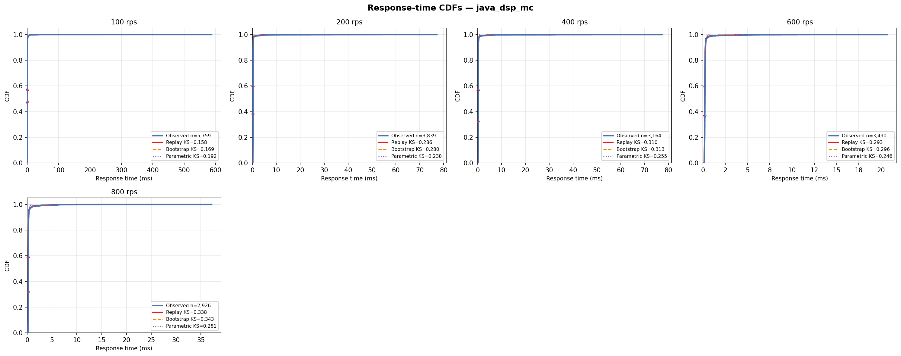

# Java DSP-AES Pipeline (3-Thread Pool, 3 Cores)

## Experimental Design

| Parameter | Value |
|---|---|
| Architecture | Java ThreadPoolExecutor(3, 3, ...) on 3 CPU cores (M/G/3) |
| Service pipeline | Same AES-FIR-AES pipeline as java_dsp_1c, ~0.2ms per thread |
| DES model | M/G/3 — `analysis/des/multi_server_des.py --workers 3` |
| CPU cores | 3 (`cpuset=0,1,2`, `cpus=3.0`) |
| Memory limit | 512m |
| Port | 8090 |
| Sweep duration | 90 s per rate point |
| Load seed | 42 |

## Results

| Rate (rps) | n | rho | svc p50 (ms) | resp p50 (ms) | resp p99 (ms) | KS replay | KS bootstrap | KS parametric |
|---|---|---|---|---|---|---|---|---|
| 100 | 5,759 | 0.016 | 0.470 | 0.294 | 3.856 | 0.158 | 0.169 | 0.192 |
| 200 | 3,839 | 0.017 | 0.253 | 0.213 | 1.791 | 0.286 | 0.280 | 0.238 |
| 400 | 3,164 | 0.040 | 0.297 | 0.216 | 1.691 | 0.310 | 0.313 | 0.255 |
| 600 | 3,490 | 0.047 | 0.236 | 0.213 | 1.361 | 0.293 | 0.296 | 0.246 |
| 800 | 2,926 | 0.069 | 0.261 | 0.217 | 2.581 | 0.338 | 0.343 | 0.281 |



## Interpretation

Comparable accuracy to java_dsp_1c (KS~0.16-0.34). JVM JIT warm-up bimodality remains the binding constraint — changing from 4 to 3 threads does not reduce the GC/JIT variance in service times. Client-limited at tested rates; server capacity is well above 2000 rps.

## Files

| File | Description |
|---|---|
| `cdf.png` | Observed vs DES response-time CDFs for all tested rates |
| `*_summary.csv` | Per-rate summary: rho, percentiles, KS distances for all modes |
| `*_NNNrps.csv` | Raw request trace (arrival_unix_ns, service_ms, queue_ms, response_ms, status_code) |
| `*_NNNrps_des_replay.csv` | DES output — replay mode (observed service times in order) |
| `*_NNNrps_des_bootstrap.csv` | DES output — bootstrap mode (resample with replacement) |
| `*_NNNrps_des_parametric.csv` | DES output — parametric mode (fitted lognormal) |

## Reproducing

```bash
# 1. Start only this server
docker compose up -d java-dsp-mc

# 2. Run one load step (adjust --rate)
python analysis/load/dsp_aes_load.py --url http://localhost:8090/process --rate 200 --duration 90

# 3. Run DES on the collected trace
python analysis/des/multi_server_des.py --workers 3 \
  --input data/experiments/java_dsp_3c/<trace_file>.csv \
  --mode replay --output des_out.csv --workers 3

# 4. Re-run all DES modes and regenerate summary + CDF
python analysis/orchestration/run_des_all.py --servers java_dsp_mc
python analysis/reporting/plot_all_cdfs.py java_dsp_3c
```
