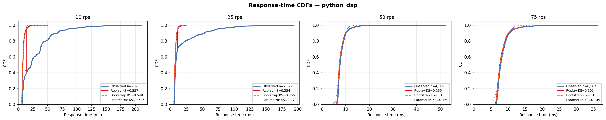

# Python/Gunicorn DSP-AES Pipeline (1 Worker, 1 Core)

## Experimental Design

| Parameter | Value |
|---|---|
| Architecture | Gunicorn --workers 1 single WSGI process (true M/G/1) |
| Service pipeline | AES-256-CBC decrypt -> 64-tap FIR (pure Python) -> AES-256-CBC encrypt (~7.5ms) |
| DES model | M/G/1 — `analysis/des/single_server_des.py` |
| CPU cores | 1 (`cpuset=0`, `cpus=1.0`) |
| Memory limit | 256m |
| Port | 8085 |
| Sweep duration | 90 s per rate point |
| Load seed | 42 |

## Results

| Rate (rps) | n | rho | svc p50 (ms) | resp p50 (ms) | resp p99 (ms) | KS replay | KS bootstrap | KS parametric |
|---|---|---|---|---|---|---|---|---|
| 10 | 987 | 0.085 | 8.488 | 21.917 | 140.544 | 0.557 | 0.549 | 0.586 |
| 25 | 2,379 | 0.204 | 8.143 | 8.784 | 119.177 | 0.254 | 0.255 | 0.270 |
| 50 | 4,509 | 0.397 | 7.934 | 7.586 | 16.123 | 0.135 | 0.135 | 0.159 |
| 75 | 6,587 | 0.613 | 8.178 | 7.816 | 17.263 | 0.105 | 0.105 | 0.149 |



## Interpretation

Near-deterministic service time (CV ~0.05) because pure Python math has no JIT variance. DES achieves KS=0.105 at steady load (50-75 rps). Warm-up transient at 10 rps inflates KS to 0.55 (first ~200 requests are slow while Python cold-starts). Capacity knee ~90-100 rps.

## Files

| File | Description |
|---|---|
| `cdf.png` | Observed vs DES response-time CDFs for all tested rates |
| `*_summary.csv` | Per-rate summary: rho, percentiles, KS distances for all modes |
| `*_NNNrps.csv` | Raw request trace (arrival_unix_ns, service_ms, queue_ms, response_ms, status_code) |
| `*_NNNrps_des_replay.csv` | DES output — replay mode (observed service times in order) |
| `*_NNNrps_des_bootstrap.csv` | DES output — bootstrap mode (resample with replacement) |
| `*_NNNrps_des_parametric.csv` | DES output — parametric mode (fitted lognormal) |

## Reproducing

```bash
# 1. Start only this server
docker compose up -d python-dsp

# 2. Run one load step (adjust --rate)
python analysis/load/dsp_aes_load.py --url http://localhost:8085/process --rate 50 --duration 90

# 3. Run DES on the collected trace
python analysis/des/single_server_des.py \
  --input data/experiments/python_dsp_1c/<trace_file>.csv \
  --mode replay --output des_out.csv

# 4. Re-run all DES modes and regenerate summary + CDF
python analysis/orchestration/run_des_all.py --servers python_dsp
python analysis/reporting/plot_all_cdfs.py python_dsp_1c
```
