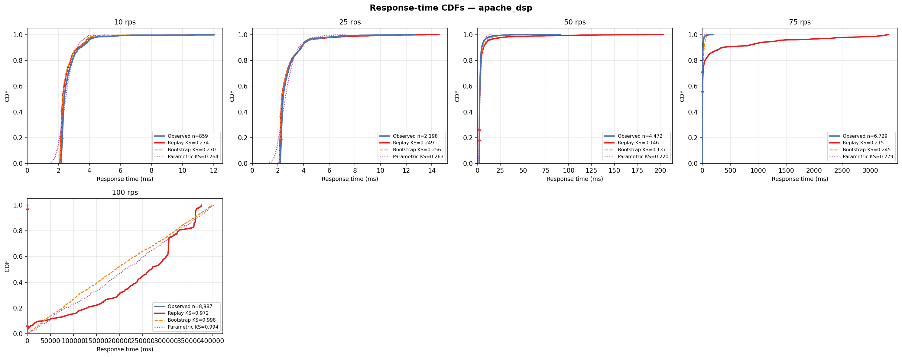

# Apache/PHP DSP-AES Pipeline (mpm_prefork, 1 Core)

## Experimental Design

| Parameter | Value |
|---|---|
| Architecture | Apache mpm_prefork — worker processes competing for one CPU core |
| Service pipeline | AES-256-CBC decrypt -> 64-tap FIR low-pass -> AES-256-CBC encrypt on 1024 float32 samples (~2.3ms) |
| DES model | M/G/1 — `logs and des/single_server_des.py` |
| CPU cores | 1 (`cpuset=0`, `cpus=1.0`) |
| Memory limit | 256m |
| Port | 8083 |
| Sweep duration | 90 s per rate point |
| Load seed | 42 |

## Results

| Rate (rps) | n | rho | svc p50 (ms) | resp p50 (ms) | resp p99 (ms) | KS replay | KS bootstrap | KS parametric |
|---|---|---|---|---|---|---|---|---|
| 10 | 859 | 0.025 | 2.534 | 2.376 | 5.620 | 0.274 | 0.270 | 0.264 |
| 25 | 2,198 | 0.066 | 2.658 | 2.394 | 6.849 | 0.249 | 0.256 | 0.263 |
| 50 | 4,472 | 0.167 | 3.337 | 2.609 | 17.346 | 0.146 | 0.137 | 0.220 |
| 75 | 6,729 | 0.435 | 5.807 | 3.110 | 48.831 | 0.215 | 0.245 | 0.279 |
| 100 | 8,987 | 5.187 | 51.865 | 11.763 | 409.073 | 0.972 | 0.998 | 0.994 |



## Interpretation

CPU contention between mpm_prefork workers on a single core causes load-dependent service time inflation. At 75 rps (rho=0.44) service time grows from 2.3ms to ~3ms; at 100 rps it explodes to ~9.5ms. DES KS is acceptable below rho=0.2 (KS~0.14) but collapses at saturation (KS=0.97). M/G/c c=2 reduces KS from 0.215 to 0.104 at 75 rps.

## Files

| File | Description |
|---|---|
| `cdf.png` | Observed vs DES response-time CDFs for all tested rates |
| `*_summary.csv` | Per-rate summary: rho, percentiles, KS distances for all modes |
| `*_NNNrps.csv` | Raw request trace (arrival_unix_ns, service_ms, queue_ms, response_ms, status_code) |
| `*_NNNrps_des_replay.csv` | DES output — replay mode (observed service times in order) |
| `*_NNNrps_des_bootstrap.csv` | DES output — bootstrap mode (resample with replacement) |
| `*_NNNrps_des_parametric.csv` | DES output — parametric mode (fitted lognormal) |

## Reproducing

```bash
# 1. Start only this server
docker compose up -d apache-dsp

# 2. Run one load step (adjust --rate)
python dsp_aes_load.py --url http://localhost:8083/process --rate 25 --duration 90

# 3. Run DES on the collected trace
python "logs and des/single_server_des.py" \
  --input experiments/apache_dsp_1c/<trace_file>.csv \
  --mode replay --output des_out.csv

# 4. Re-run all DES modes and regenerate summary + CDF
python run_des_all.py --servers apache_dsp_1c
python plot_all_cdfs.py apache_dsp_1c
```
