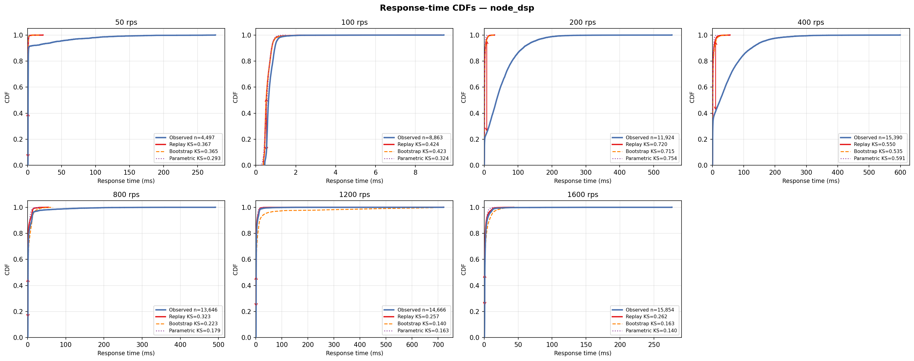

# Node.js DSP-AES Pipeline (Single Event Loop, 1 Core)

## Experimental Design

| Parameter | Value |
|---|---|
| Architecture | Single-threaded Node.js event loop — CPU-bound FIR blocks the loop, equivalent to M/G/1 |
| Service pipeline | AES-256-CBC decrypt -> 64-tap FIR -> AES-256-CBC encrypt (~0.5ms per request) |
| DES model | M/G/1 — `logs and des/single_server_des.py` |
| CPU cores | 1 (`cpuset=0`, `cpus=1.0`) |
| Memory limit | 256m |
| Port | 8084 |
| Sweep duration | 90 s per rate point |
| Load seed | 42 |

## Results

| Rate (rps) | n | rho | svc p50 (ms) | resp p50 (ms) | resp p99 (ms) | KS replay | KS bootstrap | KS parametric |
|---|---|---|---|---|---|---|---|---|
| 50 | 4,497 | 0.032 | 0.640 | 0.722 | 129.028 | 0.367 | 0.365 | 0.293 |
| 100 | 8,863 | 0.058 | 0.582 | 0.634 | 1.406 | 0.424 | 0.423 | 0.324 |
| 200 | 11,924 | 0.236 | 1.178 | 36.480 | 207.389 | 0.720 | 0.715 | 0.754 |
| 400 | 15,390 | 0.564 | 1.411 | 24.546 | 258.732 | 0.550 | 0.535 | 0.591 |
| 800 | 13,646 | 1.767 | 2.209 | 1.054 | 107.764 | 0.323 | 0.223 | 0.179 |
| 1200 | 14,666 | 2.436 | 2.030 | 0.981 | 24.230 | 0.257 | 0.140 | 0.163 |
| 1600 | 15,854 | 2.623 | 1.639 | 1.041 | 15.111 | 0.262 | 0.163 | 0.140 |



## Interpretation

Async CSV logging (fs.createWriteStream — sync version caused saturation at ~48 rps). High KS at low load (0.29-0.42) due to occasional GC/event-loop stalls creating a bimodal service time distribution the lognormal model cannot represent. Capacity knee ~600-800 rps. Inversely, KS improves at saturation (0.14) as queueing delay dominates over service time shape.

## Files

| File | Description |
|---|---|
| `cdf.png` | Observed vs DES response-time CDFs for all tested rates |
| `*_summary.csv` | Per-rate summary: rho, percentiles, KS distances for all modes |
| `*_NNNrps.csv` | Raw request trace (arrival_unix_ns, service_ms, queue_ms, response_ms, status_code) |
| `*_NNNrps_des_replay.csv` | DES output — replay mode (observed service times in order) |
| `*_NNNrps_des_bootstrap.csv` | DES output — bootstrap mode (resample with replacement) |
| `*_NNNrps_des_parametric.csv` | DES output — parametric mode (fitted lognormal) |

## Reproducing

```bash
# 1. Start only this server
docker compose up -d node-dsp

# 2. Run one load step (adjust --rate)
python dsp_aes_load.py --url http://localhost:8084/process --rate 200 --duration 90

# 3. Run DES on the collected trace
python "logs and des/single_server_des.py" \
  --input experiments/node_dsp_1c/<trace_file>.csv \
  --mode replay --output des_out.csv

# 4. Re-run all DES modes and regenerate summary + CDF
python run_des_all.py --servers node_dsp_1c
python plot_all_cdfs.py node_dsp_1c
```
