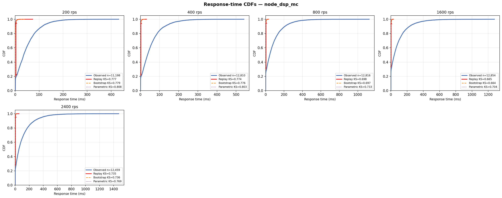

# Node.js DSP-AES Pipeline (3-Worker Cluster, 3 Cores)

## Experimental Design

| Parameter | Value |
|---|---|
| Architecture | Node.js cluster module — 3 independent event-loop processes on 3 CPU cores (M/G/3) |
| Service pipeline | Same AES-FIR-AES as node_dsp_1c, ~0.75ms per worker process |
| DES model | M/G/3 — `logs and des/multi_server_des.py --workers 3` |
| CPU cores | 3 (`cpuset=0,1,2`, `cpus=3.0`) |
| Memory limit | 512m |
| Port | 8088 |
| Sweep duration | 90 s per rate point |
| Load seed | 42 |

## Results

| Rate (rps) | n | rho | svc p50 (ms) | resp p50 (ms) | resp p99 (ms) | KS replay | KS bootstrap | KS parametric |
|---|---|---|---|---|---|---|---|---|
| 200 | 11,198 | 0.071 | 1.072 | 35.471 | 206.958 | 0.777 | 0.779 | 0.808 |
| 400 | 12,810 | 0.134 | 1.006 | 37.272 | 254.687 | 0.774 | 0.776 | 0.803 |
| 800 | 12,816 | 0.301 | 1.130 | 44.457 | 452.564 | 0.698 | 0.697 | 0.733 |
| 1600 | 12,854 | 0.610 | 1.143 | 42.132 | 546.285 | 0.665 | 0.664 | 0.704 |
| 2400 | 12,459 | 0.843 | 1.054 | 52.516 | 631.879 | 0.735 | 0.736 | 0.769 |



## Interpretation

Throughput ~2.3x single-worker due to OS connection-dispatch overhead on shared port. High KS (0.66-0.81) at all rates — OS process-scheduling latency when switching between cluster workers creates a bimodal service time distribution that the M/G/3 lognormal model cannot capture. Adding cores does not fix the root cause (distribution mismatch).

## Files

| File | Description |
|---|---|
| `cdf.png` | Observed vs DES response-time CDFs for all tested rates |
| `*_summary.csv` | Per-rate summary: rho, percentiles, KS distances for all modes |
| `*_NNNrps.csv` | Raw request trace (arrival_unix_ns, service_ms, queue_ms, response_ms, status_code) |
| `*_NNNrps_des_replay.csv` | DES output — replay mode (observed service times in order) |
| `*_NNNrps_des_bootstrap.csv` | DES output — bootstrap mode (resample with replacement) |
| `*_NNNrps_des_parametric.csv` | DES output — parametric mode (fitted lognormal) |

## Reproducing

```bash
# 1. Start only this server
docker compose up -d node-dsp-mc

# 2. Run one load step (adjust --rate)
python dsp_aes_load.py --url http://localhost:8088/process --rate 400 --duration 90

# 3. Run DES on the collected trace
python "logs and des/multi_server_des.py --workers 3" \
  --input experiments/node_dsp_3c/<trace_file>.csv \
  --mode replay --output des_out.csv --workers 3

# 4. Re-run all DES modes and regenerate summary + CDF
python run_des_all.py --servers node_dsp_3c
python plot_all_cdfs.py node_dsp_3c
```
