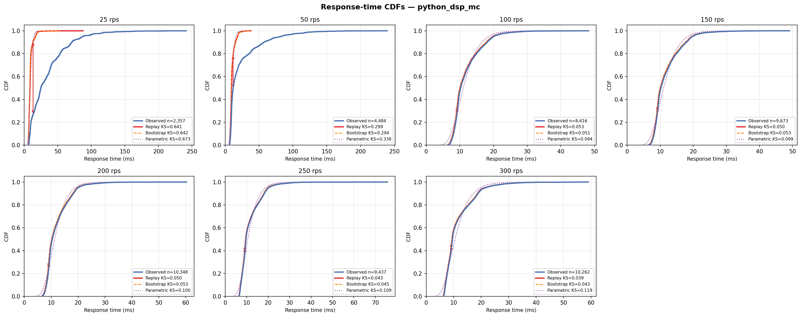

# Python/Gunicorn DSP-AES Pipeline (3 Workers, 3 Cores)

## Experimental Design

| Parameter | Value |
|---|---|
| Architecture | Gunicorn --workers 3 on 3 independent CPU cores (M/G/3) |
| Service pipeline | Same AES-FIR-AES pipeline as python_dsp_1c, ~10ms per worker |
| DES model | M/G/3 — `logs and des/multi_server_des.py --workers 3` |
| CPU cores | 3 (`cpuset=0,1,2`, `cpus=3.0`) |
| Memory limit | 512m |
| Port | 8089 |
| Sweep duration | 90 s per rate point |
| Load seed | 42 |

## Results

| Rate (rps) | n | rho | svc p50 (ms) | resp p50 (ms) | resp p99 (ms) | KS replay | KS bootstrap | KS parametric |
|---|---|---|---|---|---|---|---|---|
| 25 | 2,357 | 0.078 | 9.321 | 24.859 | 134.269 | 0.641 | 0.642 | 0.673 |
| 50 | 4,484 | 0.171 | 10.271 | 11.821 | 129.484 | 0.299 | 0.294 | 0.338 |
| 100 | 8,416 | 0.389 | 11.673 | 10.247 | 26.879 | 0.053 | 0.051 | 0.094 |
| 150 | 9,673 | 0.582 | 11.642 | 10.219 | 26.678 | 0.050 | 0.053 | 0.099 |
| 200 | 10,348 | 0.794 | 11.914 | 10.425 | 28.072 | 0.050 | 0.053 | 0.100 |
| 250 | 9,437 | 0.945 | 11.340 | 9.664 | 29.201 | 0.043 | 0.045 | 0.109 |
| 300 | 10,262 | 1.144 | 11.437 | 9.564 | 31.700 | 0.039 | 0.043 | 0.119 |



## Interpretation

Best M/G/c DES result in the entire study: KS=0.039-0.053 at 100-300 rps. Near-perfect accuracy achieved because: (a) near-constant service time (CV~0.05) matches lognormal model closely, (b) c=3 correctly accounts for 3 independent workers, (c) no shared state contention between Gunicorn processes. Throughput scales linearly at 3.0x. Capacity knee ~270 rps (vs ~90 for 1-worker).

## Files

| File | Description |
|---|---|
| `cdf.png` | Observed vs DES response-time CDFs for all tested rates |
| `*_summary.csv` | Per-rate summary: rho, percentiles, KS distances for all modes |
| `*_NNNrps.csv` | Raw request trace (arrival_unix_ns, service_ms, queue_ms, response_ms, status_code) |
| `*_NNNrps_des_replay.csv` | DES output — replay mode (observed service times in order) |
| `*_NNNrps_des_bootstrap.csv` | DES output — bootstrap mode (resample with replacement) |
| `*_NNNrps_des_parametric.csv` | DES output — parametric mode (fitted lognormal) |

## Reproducing

```bash
# 1. Start only this server
docker compose up -d python-dsp-mc

# 2. Run one load step (adjust --rate)
python dsp_aes_load.py --url http://localhost:8089/process --rate 100 --duration 90

# 3. Run DES on the collected trace
python "logs and des/multi_server_des.py --workers 3" \
  --input experiments/python_dsp_3c/<trace_file>.csv \
  --mode replay --output des_out.csv --workers 3

# 4. Re-run all DES modes and regenerate summary + CDF
python run_des_all.py --servers python_dsp_3c
python plot_all_cdfs.py python_dsp_3c
```
